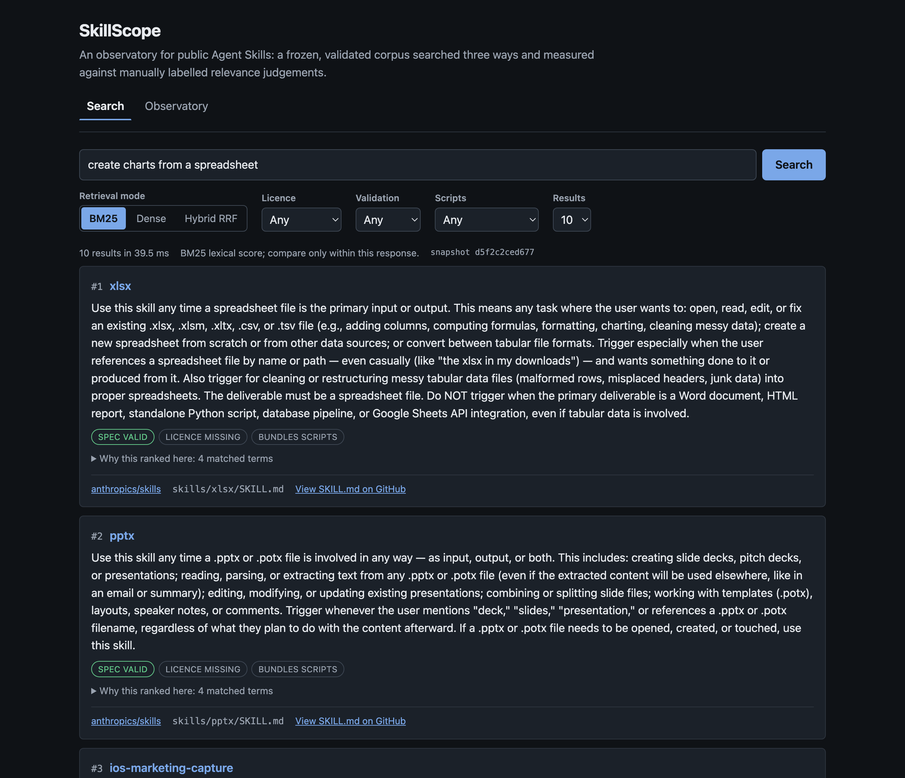
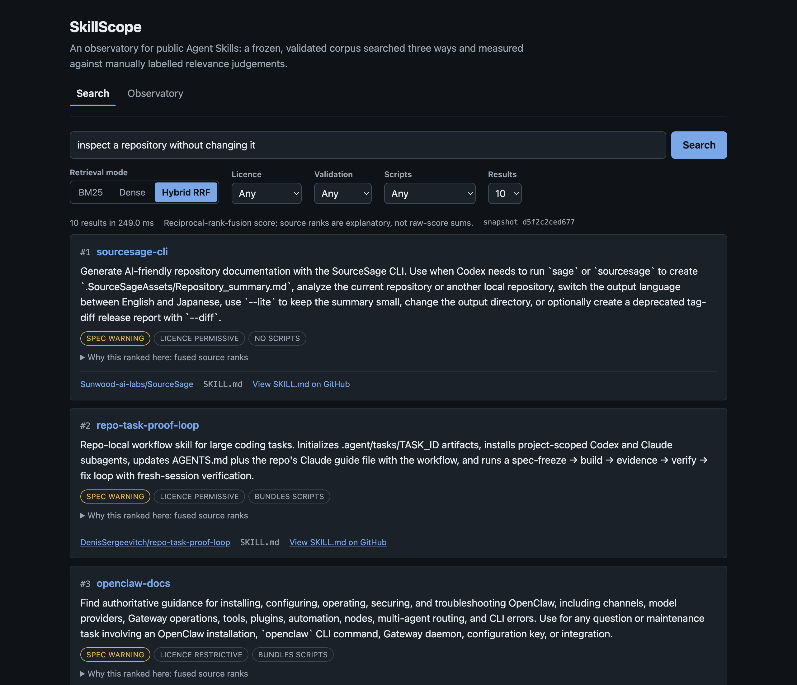
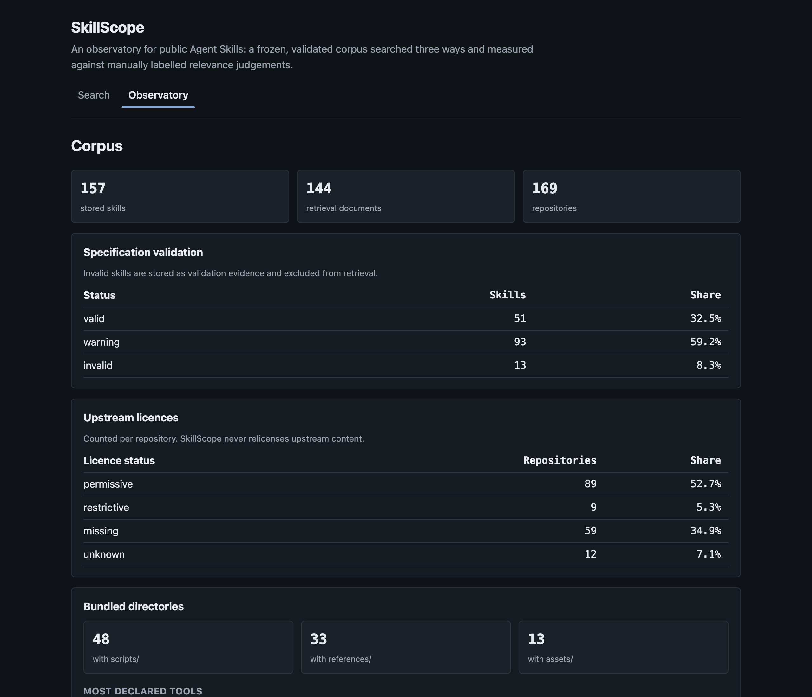
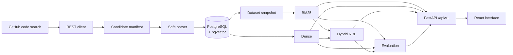

# SkillScope

**An observatory for public Agent Skills: a frozen, validated corpus searched
three ways and measured against manually labelled relevance judgements.**

SkillScope discovers public `SKILL.md` files on GitHub, parses and validates
them against the Agent Skills specification, stores reproducible metadata in
PostgreSQL, and compares BM25, dense and hybrid retrieval on the same fixed
corpus. The evaluation is the point; the search box is how you look at it.



<details>
<summary>Hybrid search and the observatory view</summary>





Regenerate these from a running stack with `./scripts/capture_screenshots.sh`.

</details>

## Measured results

Eight held-out test queries, evaluated once after the configuration was frozen.
Latency measures retrieval only, on the environment stated in
[evaluation.md](docs/evaluation.md).

| Method | nDCG@10 | MRR@10 | Recall@10 | p50 ms | p95 ms |
|---|---:|---:|---:|---:|---:|
| BM25 | **0.8363** | 0.8750 | **0.8750** | **0.584** | **0.958** |
| Dense | 0.8274 | **0.9063** | 0.8542 | 14.203 | 20.448 |
| Hybrid RRF | 0.7788 | 0.8125 | **0.8750** | 13.331 | 14.783 |

**BM25 won.** On this corpus the transparent lexical baseline had the highest
held-out nDCG@10 and was roughly twenty times faster, so it is the API default.
Dense retrieval found a relevant result soonest, and hybrid — which led on the
development split — did not hold that lead on the held-out queries. The honest
reading is that 144 documents of dense, keyword-rich technical prose is
friendly territory for BM25 and thin territory for a small embedding model. The
failure analysis in [evaluation.md](docs/evaluation.md) works through where
each method breaks.

Every number here is generated by a committed command and traceable to a
report hash. None was typed by hand.

## The problem

Agent Skills are spreading across public repositories with no shared index. To
find one you search GitHub code for `SKILL.md` and read what comes back. Two
things are missing: a way to search by *what a skill does* rather than what it
is called, and any evidence about whether a given search method actually works.

The second gap is the interesting one. It is easy to bolt a vector database
onto a corpus and declare it semantic. It is harder to label a query set, hold
part of it back, and report the result when your fancy method loses.

## What it does

- **Discovers** public `SKILL.md` files through GitHub code search, recording
  every query and page boundary.
- **Parses** YAML frontmatter and Markdown as untrusted, inert data, separating
  standard specification fields from vendor extensions.
- **Validates** against the Agent Skills specification with `valid`, `warning`
  and `invalid` outcomes and explicit messages.
- **Analyses** safe structural signals: headings, code fences, links, word and
  byte counts, and the presence of `scripts/`, `references/` and `assets/`.
- **Stores** everything in PostgreSQL with pgvector, with idempotent upserts
  and a full ingestion audit trail.
- **Searches** with transparent BM25, exact dense retrieval and reciprocal-rank
  fusion, with filters and per-method score explanations.
- **Evaluates** all three on labelled queries with nDCG@10, MRR@10 and
  judged-pool Recall@10.

## Architecture



Ingestion is a local CLI operation that writes; serving is read-only and has no
endpoint that can trigger a crawl. Full diagram and trust boundaries in
[architecture.md](docs/architecture.md).

## Dataset and licensing

The corpus is a **reproducible sample, not a census**. GitHub code search
indexes a subset of repositories and caps results, so exhaustiveness cannot be
verified and is never claimed.

| Measure | Value |
|---|---:|
| Candidates discovered | 200 |
| Stored skills | 157 |
| Retrieval-eligible skills | 144 |
| Repositories with a stored skill | 135 |
| Valid / warning / invalid | 51 / 93 / 13 |
| Labelled queries | 24 |
| Relevance judgements | 482 |

A third of the source repositories publish no licence, so **no upstream skill
content is committed here**. Manifests carry identifiers, hashes and derived
signals; bodies stay in the local database; responses carry bounded excerpts
and a link to the source. Details, biases and reproduction steps are in the
[data card](docs/data-card.md).

## Retrieval methods

**BM25** is implemented in this repository rather than delegated, with a
documented tokenizer, `k1 = 1.5`, `b = 0.75`, binary weighting for repeated
query terms, and unit tests against hand-calculated values.

**Dense** uses `sentence-transformers/all-MiniLM-L6-v2` locally, pinned to a
resolved revision, producing normalised 384-dimensional vectors searched with
exact pgvector cosine distance. No approximate index: 144 documents do not
justify trading recall for speed ([ADR 3](docs/adr/0003-exact-vector-search-first.md)).

**Hybrid** fuses the two rankings with reciprocal rank fusion over the top 50
candidates from each, with `k = 60` and equal weights. Ranks are fused, not
scores, because a BM25 score and a cosine similarity are not the same kind of
number ([ADR 4](docs/adr/0004-hybrid-rrf.md)).

See [retrieval.md](docs/retrieval.md).

## Evaluation methodology

24 task-oriented queries across six intent categories, split into 16
development and 8 locked test queries. Candidates were pooled from BM25 results
and pre-authored seeds, presented rank- and split-blinded, and graded 0
(not relevant), 1 (relevant with adaptation) or 2 (directly relevant).

Configuration was tuned on the development split only, then frozen. The test
split ran once, and the canonical report refuses to be overwritten. Full
methodology, per-query failure analysis and limitations are in
[evaluation.md](docs/evaluation.md).

## Quick start

**Requirements:** Python 3.12, [uv](https://docs.astral.sh/uv/), Node 24,
Docker with Compose.

### See it running, with no GitHub token

One command builds the stack, loads a committed demonstration corpus and serves
it:

```bash
make docker-up
```

Then open <http://localhost:5173>. The API is at <http://localhost:8000/docs>.

The demonstration corpus is twelve original skills written for this repository.
It exercises the real pipeline — the same manifest, runner, parser and snapshot
writer — with a deterministic encoder in place of the model download, so it
publishes no evaluation metrics. Tear it down with `make docker-down`.

### Work on it locally

```bash
make setup
make db-up
make migrate
```

To serve the evaluated corpus you need it ingested locally, which needs a
read-only fine-grained GitHub token in `.env`:

```bash
cp .env.example .env      # then set GITHUB_TOKEN
uv sync --locked --extra model
uv run skillscope ingest run --manifest data/manifests/candidates.jsonl
uv run --extra model skillscope index dense
```

Then run the API and interface in two terminals:

```bash
make serve
make frontend-dev
```

## Development and tests

```bash
make check              # format, lint, type-check and test both workspaces
make test               # backend suite with coverage, then frontend tests
make docker-smoke       # build, start and probe the container stack
make clean-clone-smoke  # verify a fresh clone builds and passes
make help               # every target
```

Backend: 339 tests, 85% coverage, Ruff and strict mypy.
Frontend: 27 tests, oxlint with warnings denied, and `tsc` in strict mode.

The real model smoke test is opt-in so CI never depends on Hugging Face:

```bash
make test-model
```

## API examples

```bash
curl --get http://127.0.0.1:8000/api/v1/search \
  --data-urlencode 'q=create charts from a spreadsheet'

curl --get http://127.0.0.1:8000/api/v1/search \
  --data-urlencode 'q=find something that inspects a repo without changing it' \
  --data-urlencode 'mode=hybrid' \
  --data-urlencode 'license_status=permissive' \
  --data-urlencode 'limit=5'

curl http://127.0.0.1:8000/api/v1/stats
curl http://127.0.0.1:8000/api/v1/evaluations/latest
```

Interactive documentation at <http://127.0.0.1:8000/docs>. Contract, filters,
score semantics and error envelopes in [api.md](docs/api.md).

## Engineering decisions

Recorded as ADRs, with the reasoning and the cost of each:

1. [A reproducible sample, not a census](docs/adr/0001-reproducible-sample-not-census.md)
2. [Local embeddings, not a hosted API](docs/adr/0002-local-embeddings.md)
3. [Exact vector search before any approximate index](docs/adr/0003-exact-vector-search-first.md)
4. [Rank fusion, not score addition](docs/adr/0004-hybrid-rrf.md)
5. [Metadata and derived signals, not redistribution](docs/adr/0005-metadata-not-redistribution.md)
6. [Fetch at the commit discovery recorded](docs/adr/0006-commit-pinned-ingestion.md)

Two more worth naming here. Serving reconciles the frozen corpus against the
database on every request, which cost roughly 450 ms; it is now cached behind a
fingerprint over the configurations, the snapshot and every stored skill, so
drift still forces the rebuild that rejects it. And BM25 is the API default
because it won the held-out comparison, not because it was first.

## Limitations

- **The corpus is query-shaped.** Four discovery queries and one seed
  repository decide what is in it. English and Latin script are
  over-represented.
- **Recall is judged-pool recall.** A relevant skill nobody pooled is invisible
  to the metric.
- **One labeller.** Judgements were AI-assisted under blinding and reviewed by
  the author. There is no inter-annotator agreement figure.
- **144 documents is small.** Metric differences of a few points across eight
  test queries are not statistically strong, and the README does not treat them
  as such.
- **Validation is conformance, not quality.** A valid skill can be useless.
- **Point-in-time.** Pinned commits keep the corpus reproducible while they
  remain reachable, not forever.

## Roadmap

Deferred deliberately, in rough order of value:

1. A second labeller and an agreement figure.
2. Field-weighted BM25, evaluated against the unweighted baseline rather than
   replacing it silently.
3. Wider discovery: more query partitions, more seeds, non-English queries.
4. Incremental refresh on a schedule, with drift reported rather than hidden.
5. Approximate vector search — only once a measurement demands it.

## Licence and acknowledgements

SkillScope's source is MIT licensed; see [LICENSE](LICENSE). **Indexed skills
remain governed by their own repository licences and are not relicensed by this
project.**

- Agent Skills specification: <https://agentskills.io/specification>
- `anthropics/skills`, the discovery seed: <https://github.com/anthropics/skills>
- `sentence-transformers/all-MiniLM-L6-v2`:
  <https://huggingface.co/sentence-transformers/all-MiniLM-L6-v2>
- pgvector: <https://github.com/pgvector/pgvector>

## Documentation

| Document | Contents |
|---|---|
| [PROJECT_STATUS.md](PROJECT_STATUS.md) | Verified checkpoint and metrics |
| [architecture.md](docs/architecture.md) | Components, trust boundaries, data flow |
| [data-card.md](docs/data-card.md) | Collection, counts, biases, reproduction |
| [evaluation.md](docs/evaluation.md) | Methodology, results, failure analysis |
| [retrieval.md](docs/retrieval.md) | Tokenisation, BM25, dense, fusion |
| [api.md](docs/api.md) | Endpoint contract and semantics |
| [interface.md](docs/interface.md) | Interface structure and safety |
| [discovery.md](docs/discovery.md) | Discovery queries and sampling limits |
| [ingestion.md](docs/ingestion.md) | Ingestion contract and idempotency |
| [threat-model.md](docs/threat-model.md) | Threats and controls |
| [SECURITY.md](SECURITY.md) | Responsible disclosure |
| [release-notes-v0.1.0.md](docs/release-notes-v0.1.0.md) | Release summary and reproduction |
