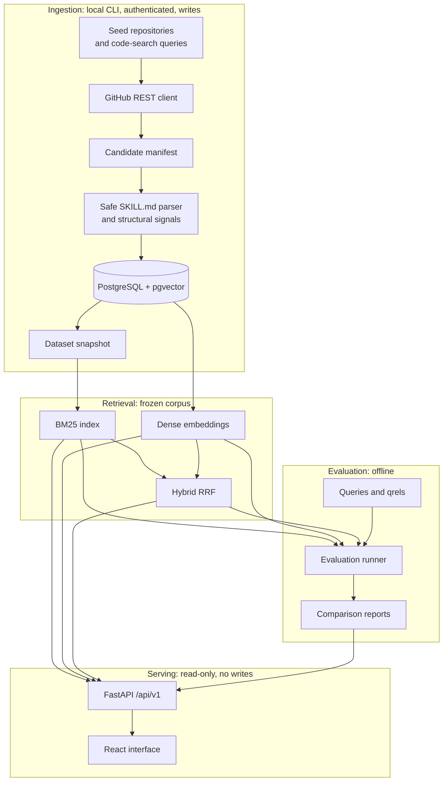

# Architecture

SkillScope has two paths that never meet at runtime: a trusted local ingestion
path that writes, and a public read-only serving path that does not.

## Trust boundaries

There are three, and they matter more than the component diagram.

**GitHub responses are untrusted input.** Owners, repository names, paths and
refs are validated against conservative patterns before they are used to build
a request URL. Only allowlisted GitHub hosts are contacted, redirects must stay
on GitHub, files are capped at 256 KiB and directory listings at 1,000 entries.

**Skill content is inert data.** A `SKILL.md` body is parsed, measured and
indexed. Its instructions are never followed, its scripts are never downloaded
or executed, and its links are never fetched. Referenced relative paths are
recorded as strings, not resolved.

**The serving path cannot write.** There is no endpoint that triggers
discovery, ingestion, parsing or embedding. The API opens read-only sessions,
returns bounded excerpts rather than bodies, and has no access to the GitHub
token — the container image does not receive one.

## Ingestion

Discovery runs seed-first, then broad code-search queries, deduplicating by
GitHub repository ID and path and sorting deterministically. Every query and
page boundary is written to the candidate manifest.

For each candidate the runner refreshes repository metadata once per
repository, checks the stored blob SHA and records `unchanged` without
fetching when it matches. Otherwise it fetches the file at the commit
discovery recorded (ADR 6), verifies the path and blob SHA still match, lists
only the immediate skill directory, parses the content and upserts the
repository, skill and supporting-file metadata in one transaction.

Per-item failures are recorded with a stable category and a safe message, and
the run continues. Reconciled counters and a body-free dataset snapshot close
the run.

## Storage

PostgreSQL is the source of truth. `repositories` and `skills` hold the
normalised entities, with `skills` unique on `(repository_id, path)` so
re-ingestion updates rather than duplicates. `skill_files` holds supporting-file
metadata only. `ingestion_runs` and `ingestion_run_items` hold the audit trail.
`evaluation_queries`, `qrels` and `evaluation_runs` hold the evaluation record.

Embeddings live in a `vector(384)` column beside the provenance that makes them
verifiable: model identifier, resolved revision, configuration hash, content
hash and the hash of the exact text embedded.

## Retrieval

The frozen corpus is the set of stored skills whose validation status is valid
or warning, reconciled against the dataset snapshot: every frozen identity must
be present, with a matching content hash and validation status. Any drift
raises rather than silently serving a different corpus.

BM25 is implemented in the repository over that corpus, with documented
tokenisation, `k1 = 1.5`, `b = 0.75` and binary weighting for repeated query
terms. Dense retrieval uses exact pgvector cosine distance. Hybrid fuses the
two rankings with reciprocal rank fusion.

A serving process caches the reconciled corpus and its BM25 index behind a
fingerprint over both configuration files, the snapshot and every stored
skill's content hash, validation status, script flag and repository licence.
Drift changes the fingerprint and forces the full reconciling rebuild that
would have rejected it.

## Evaluation

Twenty-four task-oriented queries are split into sixteen development and eight
locked test queries. Candidates were pooled from BM25 results and pre-authored
seeds, presented rank- and split-blinded, and graded 0, 1 or 2.

Metrics are macro nDCG@10, MRR@10 and judged-pool Recall@10. Test metrics are
locked behind an explicit flag, and the canonical test report refuses to be
overwritten, so the held-out comparison ran once after the configuration was
frozen.

## Serving

Six read-only endpoints: liveness, readiness, search, skill detail, statistics
and the latest evaluation. Readiness checks database connectivity, frozen
evidence integrity, embedding coverage and the model runtime; liveness checks
none of them. Details are in [api.md](api.md).

## Why ingestion is not an endpoint

Exposing ingestion would hand an anonymous caller the project's GitHub token
budget, let them choose which URLs the server fetches, and let them write to
the corpus that the evaluation reports are bound to. Discovery and ingestion
are therefore a local CLI operation run deliberately by someone holding a
token, and the frozen corpus the API serves is an artefact of that run.
